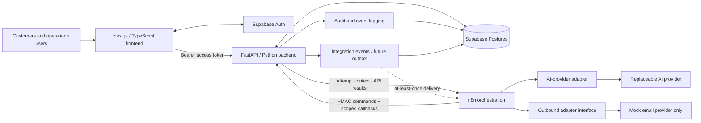

# Proposed Architecture

## Status and intent

This document describes a proposed conceptual architecture for the AI Operations Automation Suite MVP. None of these application components has been implemented. The design supports the approved [product brief](product-brief.md), [domain model](domain-model.md), [lifecycle state machines](state-machines.md), [API contracts](api-contracts.md), [event/n8n contracts](event-contracts.md), [authentication and authorization](authentication-and-authorization.md), and architecture decisions [0001](decisions/0001-canonical-state-and-lifecycle-boundaries.md), [0002](decisions/0002-api-command-and-event-boundaries.md), and [0003](decisions/0003-authentication-and-role-permissions.md) while keeping business policy testable, integrations replaceable, and important actions auditable.

## Component view

Arrows show proposed request or event flow, not deployed connections. The backend remains the authority for canonical state and business decisions.

## Component responsibilities

| Component | Proposed responsibility |
| --- | --- |
| Next.js/TypeScript frontend | Provide customer intake and operations dashboard experiences; show validation feedback, queue state, priority, routing, proposed actions, approvals, failures, and audit history. It calls backend APIs and does not enforce authoritative business policy. |
| Supabase Auth | Authenticate human users and issue short-lived access tokens. Application roles remain authoritative in Postgres rather than client-supplied or editable token/body values. |
| FastAPI/Python backend | Validate human bearer tokens and WorkflowService HMAC/attempt scope; load fixed application roles; enforce endpoint/field permissions, self-approval prohibition, validation, normalization, canonical state transitions, idempotency, duplicate handling, deterministic routing, approval, retry, and audit emission. |
| Supabase Postgres | Persist normalized requests, contacts or contact references, idempotency records, AI results, duplicate candidates, queue and status state, proposed actions, approvals, integration attempts, and audit events. It is the durable system of record. |
| n8n orchestration | Coordinate asynchronous and multi-step workflows, invoke allowlisted provider adapters for backend-created attempts, and report constrained evidence through backend commands/callbacks. It passes correlation identifiers but does not become the source of truth or decide policy. |
| Replaceable AI-provider adapter | Present a stable, workflow-invoked interface for structured summary, category suggestion, missing-information list, and confidence. It validates provider output and isolates provider-specific payloads, credentials, timeouts, and errors. AI output remains advisory. |
| Replaceable outbound-integration adapters | Present stable, workflow-invoked commands and result types for outbound actions. The proposed MVP adapter is a clearly labeled mock email provider that records simulated success or failure and sends no real email. Future real adapters must not change approval rules. |
| Audit/event logging | Capture important domain transitions, human decisions, errors, retries, and integration attempts with correlation, actor, time, outcome, and sanitized context. Canonical audit writes persist to Postgres. Separate PII-minimized integration events are proposed for at-least-once delivery through a future transactional outbox; neither depends on n8n execution history or console logs. |

## Why deterministic decisions stay in backend code

AI is suitable for interpreting unstructured language, but priority, routing, approval requirements, authorization, idempotency, retry eligibility, and state transitions are business decisions. They must remain in backend code because backend rules can be versioned, tested, reproduced, reviewed, and applied consistently when a provider or prompt changes.

Prompts and n8n workflows may collect evidence or coordinate steps, but they must not silently redefine policy. The backend accepts validated AI evidence, combines it with normalized request data and configuration, calculates the decision, persists the result, and emits the corresponding audit event. The frontend displays those decisions without becoming an alternative enforcement path.

## Proposed processing boundaries

1. The frontend submits an intake payload and idempotency key to the backend.
2. The backend validates and normalizes the payload, atomically registers idempotency, and persists canonical request state.
3. The backend records duplicate candidates and creates an AI attempt; n8n invokes the replaceable AI adapter for that exact attempt and returns constrained evidence.
4. The backend validates the structured AI result and executes deterministic priority, routing, and review rules.
5. n8n coordinates eligible follow-up steps using request and correlation identifiers; durable state changes occur through backend commands.
6. The backend creates a versioned proposed response or scheduling invitation and records the approval requirement.
7. An authorized user approves or rejects that exact proposal through the backend.
8. Only an approved proposal may produce an outbound attempt. n8n invokes the mock outbound adapter for that exact attempt; the mock provider records a simulated result and sends nothing.
9. Each material transition and attempt adds audit evidence. Failures move the request to a recoverable state without erasing earlier events.

## Adapter and reliability expectations

- Application-facing adapter contracts should use provider-neutral request, result, and error types.
- Provider credentials and raw payload details must remain behind adapter boundaries and outside source control.
- Each integration attempt should have its own identifier, correlation to the request and approved action, timestamps, outcome, and sanitized error details.
- Timeouts and transient failures should produce explicit states and bounded, controlled retries.
- Idempotency must protect intake and side effects independently; a webhook key alone is not sufficient protection for outbound retries.
- A provider replacement must not alter deterministic rules, approval enforcement, or audit requirements.

## Data and audit principles

- Postgres is the canonical source for operational state; n8n execution data is supporting telemetry only.
- Authorized FastAPI commands exclusively control canonical lifecycle transitions. Important backend-controlled state changes and their audit events commit transactionally.
- Authentication identifies the caller, centralized permission mapping authorizes the command/query class, and domain guards separately validate the specific transition. No role bypasses the latter.
- Important event history is append-oriented. Corrections create new events rather than rewriting the historical record.
- Canonical audit events and integration delivery messages are separate records. State, audit evidence, and future outbox messages must commit together.
- Audit records distinguish canonical human and service actors while recording external or mock providers only as sanitized evidence metadata, never as API actors.
- Sensitive data is minimized and sanitized before logging or sending to an AI provider.
- The future detailed design must define retention, access controls, transactional boundaries, event schemas, and recovery behavior before implementation.

## Deployment note

No deployment topology is approved through the current Phase 1 design work. Docker, hosting, continuous delivery, observability vendors, and environment strategy belong to a later focused milestone. Microservices and Kubernetes are explicit MVP non-goals.
