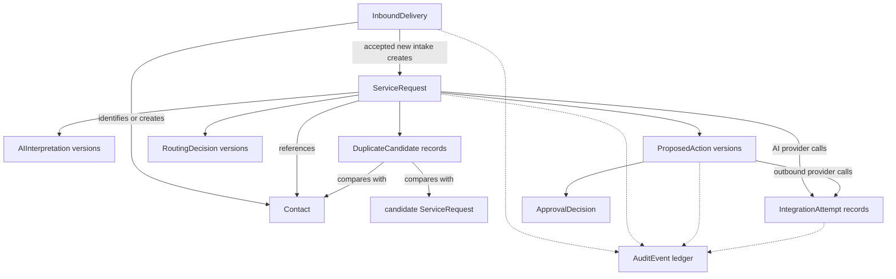

# Proposed Domain Model

## Status and scope

This document defines the approved, implementation-neutral domain model for the MVP. It refines the [product brief](product-brief.md), [proposed architecture](architecture.md), and [lifecycle state machines](state-machines.md). No database schema, ORM model, API, or application component has been implemented.

All approved concept names are retained. The model introduces no additional business entity; `proposal_series_id` and `logical_operation_id` are correlation identifiers used to preserve proposal and outbound-operation identity across versions and retries.

## Model-wide conventions

- Domain identifiers are UUIDs.
- Persisted timestamps are UTC instants. Display-time localization is a presentation concern.
- Supabase Postgres is the proposed canonical operational store.
- Only authorized FastAPI backend commands may create or change canonical lifecycle state. The frontend and n8n may request commands but cannot write authoritative state independently.
- Mutable aggregate roots carry an optimistic `version` value. A command supplies the version it observed and fails with a concurrency conflict if a newer version exists.
- Historical records retain the applicable rule, schema, prompt, and adapter version references required to explain outcomes.
- Operational and audit records are not hard-deleted in the MVP. Corrections use new versions, resolution facts, or audit events.
- Raw or normalized customer data is retained only when required for operations or evidence. Secrets never belong in domain records, and logs or audit metadata must be sanitized.

## Concept map

The arrows describe conceptual relationships, not foreign-key or aggregate implementation choices.

## Separation of operational concepts

| Concept | Question answered | Source of authority |
| --- | --- | --- |
| Service-request status | What lifecycle checkpoint has the request reached? | Backend state-machine command |
| Priority | How quickly or importantly should the request be handled? | Current versioned `RoutingDecision` produced by deterministic backend rules |
| Operational queue | Which operator view currently owns attention? | Backend-controlled queue assignment derived from status, priority, review flags, and failure state |
| Proposed-action state | What is the state of one exact proposal version? | Proposed-action state machine |
| Approval | Did an authorized person approve or reject that exact proposal version? | Immutable `ApprovalDecision` plus validity guards |
| Integration-attempt state | What happened during one provider invocation? | Integration-attempt state machine and adapter result |

These values may change together in one backend transaction, but they are not aliases. For example, an Urgent priority request can be in Human review, Awaiting approval, or Failed/retry required at different times.

## `InboundDelivery`

### Purpose and ownership

`InboundDelivery` represents one physical intake delivery, including invalid input, replays, conflicts, and failures. It is an intake aggregate root and preserves evidence even when no `ServiceRequest` is created.

### Conceptual fields

| Requirement | Important fields |
| --- | --- |
| Required | `id`, source/channel, idempotency key, received timestamp, processing status, schema version, optimistic `version` |
| Conditionally required | Canonical payload hash when the body can be canonicalized; raw-body fingerprint when malformed content is still safely identifiable and recorded |
| Optional until classified or applicable | Idempotency outcome, source delivery identifier, sanitized/raw payload reference, normalized payload, linked original delivery, linked `ServiceRequest`, rejection reasons, failure classification and sanitized error, completed timestamp |

### Relationships and behavior

- An accepted new delivery creates exactly one `ServiceRequest` and may identify or create a `Contact`.
- An accepted idempotent replay links to the original delivery and original logical result; it creates no new `ServiceRequest`.
- A rejected delivery, including an idempotency conflict, creates no normal `ServiceRequest`.
- Status and idempotency outcome are separate: replay and conflict are persisted outcome classifications, while `Received`, `Accepted`, `Rejected`, and `ProcessingFailure` are processing statuses.

### History, sensitivity, and authority

Payload hashes, outcomes, links, and terminal facts are immutable after finalization. Raw customer payloads may contain contact details and free text; access, retention, encryption, and redaction must be narrower than for general operational metadata. The backend intake boundary creates and finalizes records. An authorized backend recovery command may retry only a `ProcessingFailure` record.

## `Contact`

### Purpose and ownership

`Contact` represents the minimum normalized customer identity and communication details needed to associate service requests and detect likely duplicates. It is its own aggregate root so corrections do not rewrite request history.

### Conceptual fields

| Requirement | Important fields |
| --- | --- |
| Required | `id`, display name or stable fallback label, created/updated UTC timestamps, optimistic `version` |
| Optional | Normalized email, normalized phone, preferred contact channel, source references, archival marker, replacement/merge reference |

### Relationships and behavior

- A contact can have many `ServiceRequest` records.
- `DuplicateCandidate` records may compare contacts or requests.
- A suspected match never silently merges contacts. An authorized resolution may link or supersede a contact while preserving both histories.

### History, sensitivity, and authority

Email, phone, and names are sensitive customer data. Store only necessary values, restrict audit snapshots, and mask them in general logs. The backend creates contacts from accepted input. Authorized operations or administrator commands may correct or resolve them using optimistic concurrency; prior values remain explainable through audit evidence.

## `ServiceRequest`

### Purpose and ownership

`ServiceRequest` is the canonical aggregate root for one valid customer need and its operational lifecycle. Invalid deliveries never become service requests.

### Conceptual fields

| Requirement | Important fields |
| --- | --- |
| Required | `id`, originating `InboundDelivery` ID, `Contact` ID, normalized request description, lifecycle status, created/updated timestamps, optimistic `version` |
| Optional until determined or applicable | Current priority, current operational queue, final service category, location or service context, customer timing preference, current routing-decision ID, current AI-interpretation ID, active proposed-action ID, review/failure reason summary, terminal/closed timestamp |

### Relationships and behavior

- It belongs to one originating accepted-new delivery and one contact.
- It owns or references versioned `AIInterpretation`, `RoutingDecision`, and `ProposedAction` records plus duplicate candidates.
- It summarizes the current operational checkpoint but does not replace approval, proposal, or integration-attempt state.
- Status transitions and their `AuditEvent` records are committed atomically by backend commands.

### History, sensitivity, and authority

The normalized description and context can contain sensitive or safety-relevant information. Minimize copies in audit metadata and AI payloads. Only authorized backend commands create or transition a request. Corrections that change decision inputs produce new interpretation or routing versions rather than rewriting historical decisions.

## `AIInterpretation`

### Purpose and ownership

`AIInterpretation` stores one advisory, structured AI result for a service request. It is an immutable versioned child of `ServiceRequest` and never carries authority to change priority, queue, approval, or lifecycle state.

### Conceptual fields

| Requirement | Important fields |
| --- | --- |
| Required | `id`, `ServiceRequest` ID, interpretation version, structured summary, suggested category, missing-information list, confidence value, input snapshot/hash, schema version, prompt version, adapter/provider/model reference, created timestamp |
| Optional | Provider request/correlation reference, sanitized warnings, latency/usage metadata, superseded-by interpretation ID |

### Relationships and behavior

- A request can have multiple interpretations; one may be designated current for the next routing calculation.
- A `RoutingDecision` records the exact interpretation version it considered.
- A successful AI-provider `IntegrationAttempt` produces at most one accepted interpretation result for its logical operation.
- Provider failures create failure evidence and request recovery state; they do not create a fabricated interpretation.

### History, sensitivity, and authority

Interpretations are immutable. A rerun creates a new version. Summaries may reproduce sensitive customer text, so retention and access should match the underlying request and raw provider responses should not be stored by default. The backend AI adapter creates results after validating their structure; n8n may coordinate the call but cannot write a trusted result directly.

## `DuplicateCandidate`

### Purpose and ownership

`DuplicateCandidate` records evidence that a service request or contact may match another existing record and preserves the human resolution. It is owned by the source `ServiceRequest` review boundary.

### Conceptual fields

| Requirement | Important fields |
| --- | --- |
| Required | `id`, source `ServiceRequest` ID, candidate type and candidate ID, detection reason(s), detection method/rule version, detected timestamp, resolution status |
| Optional | Match score or confidence, resolver actor, resolution reason, resolved timestamp, superseding request/contact reference |

### Relationships and behavior

- It points from one source request to a candidate `ServiceRequest` or `Contact`.
- Multiple candidates can exist for one request.
- Resolution is explicit: confirmed duplicate, not duplicate, or still pending. A confirmed duplicate can close the source request without deleting or silently merging it.

### History, sensitivity, and authority

Detection evidence is immutable; resolution fields are written once by an authorized resolution command, and corrections require a new resolution event or candidate record. Matching evidence can expose customer identifiers, so operator views must reveal only what is needed. Backend rules create candidates; authorized operations users resolve them through backend commands.

## `RoutingDecision`

### Purpose and ownership

`RoutingDecision` is the reproducible output of deterministic backend rules for final category, priority, operational queue, and review requirements at a point in time. It is an immutable versioned child of `ServiceRequest`.

### Conceptual fields

| Requirement | Important fields |
| --- | --- |
| Required | `id`, `ServiceRequest` ID, decision version, normalized input snapshot/hash, rule-set version, final priority, operational queue, review-required flags and reasons, decided timestamp |
| Optional | AI-interpretation ID, duplicate-candidate references, final category, prior decision ID, operator override actor/reason and governing policy reference |

### Relationships and behavior

- It records exactly which request, AI, duplicate, and configuration evidence produced the decision.
- The request points to its current decision; older decisions remain historical.
- A routing decision records the initial or recalculated operational queue. Later queue movement caused solely by lifecycle progress follows backend transition policy and audit evidence without requiring a fabricated routing recalculation.
- A permitted human override is still a backend rule path and records actor, reason, and policy—not a direct UI field edit.

### History, sensitivity, and authority

Decisions are immutable and versioned. Inputs should use hashes or minimal snapshots to avoid duplicating customer data. Only deterministic backend policy code creates a routing decision and atomically updates the request's current priority/queue plus audit evidence.

## `ProposedAction`

### Purpose and ownership

`ProposedAction` represents one exact version of a proposed customer-facing response or scheduling invitation. It is a lifecycle aggregate associated with one service request. A proposal family is correlated by `proposal_series_id`; one intended side effect is correlated across retries by `logical_operation_id`.

### Conceptual fields

| Requirement | Important fields |
| --- | --- |
| Required | `id`, `ServiceRequest` ID, `proposal_series_id`, proposal version, `logical_operation_id`, action type, destination reference, content/payload snapshot and digest, state, creator actor UUID, approval-excluded actor UUIDs, created timestamp, optimistic `version` |
| Optional | Scheduling details, material-editor attribution, supersedes/superseded-by proposal ID, current valid approval ID, execution outcome summary, terminal timestamp |

### Relationships and behavior

- One service request can have multiple proposal families and versions, but only an explicitly active version advances toward execution.
- An `ApprovalDecision` binds to this record's ID, version, and payload digest.
- `IntegrationAttempt` records share its `logical_operation_id` and exact approved proposal version.
- Materially changing a `PendingApproval`, `Approved`, or `RetryableExecutionFailure` proposal creates a replacement `Draft`, supersedes the earlier version, and atomically moves the parent request to `ActionRevisionRequired` in `Human review`.
- The parent request's active-proposal reference moves to the replacement. Any execution recovery target is cleared, and no decision transfers to the replacement.
- A prior approval and all failed attempts remain immutable historical evidence but cannot authorize the replacement proposal.
- `Executed` and `TerminalExecutionFailure` proposals cannot be reopened by an ordinary revision command. Terminal recovery would require a separately approved future design.
- Creator and material-editor attribution is append-oriented while a draft changes. Submission freezes the actor UUIDs excluded from approving/rejecting that exact payload; display names and later role changes never alter the guard.

### History, sensitivity, and authority

Submitted proposal snapshots are immutable; revisions create versions. A draft may be edited under optimistic concurrency without changing lifecycle state, but submission freezes its version and digest. Resubmitting a replacement requires the active proposal to be `Draft`, advances it to `PendingApproval`, moves the request to `AwaitingApproval`, and requires a new decision. Content and destination are sensitive customer communication data. Authorized operator commands create or submit drafts; authorized approvers decide; only backend execution commands advance execution state.

## `ApprovalDecision`

### Purpose and ownership

`ApprovalDecision` is an immutable human decision to approve or reject one exact proposed-action version. It belongs to the proposed-action approval boundary and is never a generic approval for a request.

### Conceptual fields

| Requirement | Important fields |
| --- | --- |
| Required | `id`, proposed-action ID and version, proposal payload digest, decision (`Approved` or `Rejected`), approver actor ID/role, decided timestamp |
| Optional | Rationale, policy reference |

### Relationships and behavior

- A proposal submission can receive one effective decision. Duplicate commands return the existing result or conflict rather than creating contradictory decisions.
- Approval validity requires an authorized `ManagerApprover` or `Administrator` whose actor UUID is not excluded by proposal attribution, an unchanged exact proposal version/digest, an executable action state, and no superseding proposal.
- A new material proposal version makes the prior approval ineffective for future execution, as evidenced by proposal state and a new audit event; it never deletes or edits the historical decision.

### History, sensitivity, and authority

Decisions are append-only and must preserve actor attribution. Rationales may contain sensitive operational notes and require role-based access and sanitization. Only an authorized approver command handled by the backend may create a decision.

## `IntegrationAttempt`

### Purpose and ownership

`IntegrationAttempt` records one invocation of a replaceable provider adapter. The MVP uses it for AI interpretation calls and mock outbound calls. It is an execution aggregate linked to the owning service request and, for outbound work, the exact proposed-action version. Retries create new attempts rather than mutating or replacing earlier attempts.

### Conceptual fields

| Requirement | Important fields |
| --- | --- |
| Required | `id`, operation kind (`AIInterpretation` or `OutboundAction`), owning `ServiceRequest` ID, `logical_operation_id`, attempt number, adapter name and version, state, created timestamp, optimistic `version` |
| Conditionally required | Proposed-action ID/version and stable outbound idempotency key for `OutboundAction`; AI input hash plus prompt/schema/provider references for `AIInterpretation` |
| Optional | Started/completed timestamps, provider correlation/reference, sanitized request/response metadata, produced AI-interpretation ID, failure classification, error code/message, retry eligibility and next-eligible timestamp |

### Relationships and behavior

- Many attempts can belong to one logical operation, but at most one can be running and at most one attempt can succeed.
- AI attempts link to the service request and immutable input/version references; a success can create one `AIInterpretation`.
- Outbound attempts link to the exact proposal version and use the same stable outbound idempotency key so adapter-level deduplication can protect uncertain retries.
- A retry creates the next numbered attempt only when no attempt succeeded, no attempt is active, and the previous failure is retryable. Outbound retry additionally requires approval to remain valid for the exact proposal.

### History, sensitivity, and authority

Attempts and outcomes are immutable after terminalization. AI inputs/outputs and outbound destinations/content can contain sensitive data; provider metadata must omit secrets and minimize customer content. Only the backend creates attempts and accepts adapter results; n8n may request execution or recovery through backend commands. The proposed outbound MVP adapter is mock-only and records simulated success or failure without sending email.

## `AuditEvent`

### Purpose and ownership

`AuditEvent` is the append-oriented evidence ledger for material domain transitions, decisions, errors, recoveries, and integration activity. It is separate from mutable aggregates and is not a substitute for their current state.

### Conceptual fields

| Requirement | Important fields |
| --- | --- |
| Required | `id`, event type and schema version, aggregate type/ID, aggregate version, occurred-at UTC timestamp, actor type/ID, command or correlation ID, outcome |
| Optional | Causation event ID, request/delivery/action/attempt references, sanitized reason and change metadata, rule/prompt/schema/adapter version references |

### Relationships and behavior

- Events correlate all important delivery, request, proposal, approval, and attempt changes.
- Backend-controlled state change and its audit event commit in the same database transaction.
- External observations that cannot share the transaction are recorded through an idempotent backend result command with correlation and causation identifiers.

### History, sensitivity, and authority

Audit events are append-only and not hard-deleted in the MVP. They store identifiers and minimal sanitized evidence rather than full secrets or unrestricted payloads. Backend commands emit authoritative events; infrastructure may emit supporting telemetry, but n8n logs or provider logs are not canonical audit history.

## Aggregate and transaction boundaries

- Intake acceptance atomically finalizes the new `InboundDelivery`, creates the initial `ServiceRequest` when valid and new, and writes audit events. Contact creation or association participates when the selected persistence design can preserve the same invariant.
- A service-request command atomically checks its optimistic version, changes request state and current routing/queue references, and appends audit evidence.
- Approval atomically creates the immutable decision, advances the exact proposal, updates the service-request summary where applicable, and appends audit evidence.
- Material revision atomically checks request and proposal versions, authority, proposal family, approval state, and attempt history; supersedes the old proposal; creates and activates the replacement draft; moves the request to `ActionRevisionRequired` and `Human review`; clears obsolete execution recovery data; and appends audit evidence. Any prior approval or attempt remains unchanged. If any guard or write fails, the entire revision rolls back.
- Attempt creation atomically verifies operation-specific input/version guards and creates one pending attempt with audit evidence. Outbound creation additionally verifies exact approval and side-effect idempotency and advances the proposal summary.
- Attempt result handling atomically terminalizes the attempt and appends audit evidence. AI success creates the immutable interpretation; outbound results update proposal and service-request summaries.

Cross-aggregate implementation details remain deferred, but no design may relax these invariants through eventual consistency at the authorization or duplicate-side-effect boundary.
