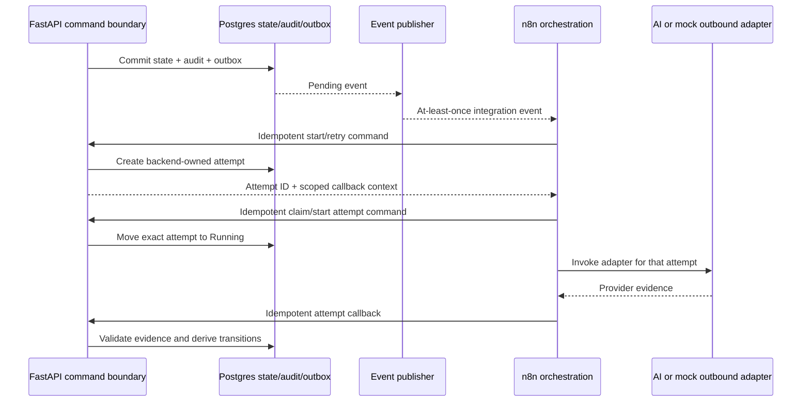

# Proposed Event and n8n Contracts

## Status and scope

This document defines the approved integration-event and n8n boundaries. Atomic intake and the two implemented AI commands create PII-minimized `Pending` outbox rows transactionally with canonical audit evidence. Start AI creates `integration_attempt.created`; claim/start creates `integration_attempt.started` when its exact attempt becomes `Running`. No publisher, message transport, n8n workflow, provider invocation, callback, or event consumer is implemented.

## Record types and authority

| Record/message | Purpose | Canonical? |
| --- | --- | --- |
| Domain state | Current category, lifecycle, priority, queue, approval, proposal, and attempt facts in Postgres | Yes |
| `AuditEvent` | Append-oriented evidence explaining a material command, transition, decision, or failure | Yes |
| Integration event | PII-minimized delivery message notifying consumers that a canonical fact changed | No; consumers may query the API for current truth |
| Outbox record | Proposed durable publication work item written with state and audit evidence | No; it supports reliable delivery |
| n8n execution history | Orchestration telemetry and troubleshooting context | No |

An audit event and an integration event may share correlation, causation, aggregate, and event-type meaning, but they are not the same database record. Publishing or deleting a delivery message never changes canonical audit history.

## Event envelope

```json
{
  "event_id": "8e65f169-f9ac-43c2-a340-6f4579d17913",
  "event_type": "service_request.created",
  "event_schema_version": "1.0",
  "occurred_at": "2026-07-10T08:15:30Z",
  "correlation_id": "3a9d9af4-a611-4e10-b916-50d07ff56748",
  "causation_id": "b0f34ee4-d16c-4adc-933e-aabcf8d86253",
  "aggregate": {
    "type": "ServiceRequest",
    "id": "f33809eb-cf57-480a-9a89-aed2469fe55a",
    "version": 1
  },
  "actor": {
    "type": "BackendService",
    "id": "6d12d1c1-c8b2-4bd3-beb4-2c37517d0858"
  },
  "audit_event_id": "ab3a1661-b8b4-4a42-b15b-cb3c5a474b1d",
  "data": {
    "service_request_id": "f33809eb-cf57-480a-9a89-aed2469fe55a",
    "status": "TriagePending"
  }
}
```

### Envelope rules

- `event_id` is a UUID assigned when the outbox message is created and is the consumer deduplication key.
- `event_type` is a stable lowercase dot-separated value.
- `event_schema_version` versions the type-specific `data` contract.
- `occurred_at` is the UTC time of the canonical change, not a later publish attempt time.
- `correlation_id` groups one user or workflow operation. `causation_id` identifies the command, prior event, or attempt that directly caused this event.
- `aggregate.version` is the resulting canonical version and the only ordering signal guaranteed to consumers.
- `actor.type` is one of `Customer`, `OperationsAgent`, `ManagerApprover`, `Administrator`, `BackendService`, `WorkflowService`, or `EventPublisher`. Actor IDs are internal UUIDs, not names or email addresses. `Customer` represents a backend-generated non-login reference for `PublicCustomer` intake, not a trusted customer-supplied identity.
- `audit_event_id` links to canonical evidence when authorization permits; the integration event remains a distinct message.
- `data` contains identifiers, stable enum values, version references, and minimal transition facts only.

## Privacy and payload rules

Customer PII is excluded from envelopes by default. Event payloads must not contain names, email addresses, phone numbers, physical addresses, free-form request descriptions, proposed message content, approval rationale, raw AI input/output, provider payloads, secrets, or stack traces.

Consumers needing authorized detail call a query endpoint using the resource ID. Event schemas use allowlists rather than attempting to redact arbitrary serialized domain objects. Sanitized failure events may include stable failure codes and adapter versions but not raw errors.

## Publication and delivery guarantees

### Transaction boundary

The proposed persistence implementation must follow the transactional-outbox pattern:

1. The backend validates the command and expected versions.
2. In one database transaction it changes canonical state, appends required `AuditEvent` records, and inserts immutable outbox messages with final `event_id` and aggregate version.
3. A separate publisher delivers outbox messages and records publication attempts.
4. Publisher failure never rolls back already committed domain state or audit evidence; the pending outbox item remains retryable.

Writing an event only after committing state without a durable outbox-equivalent is not acceptable because a process crash could lose the notification.

### Delivery semantics

- Delivery is at least once. Duplicate delivery is expected.
- Consumers persist processed `event_id` values and acknowledge only after their own work commits.
- There is no global ordering guarantee across aggregates or event types.
- Events for one aggregate carry monotonically increasing `aggregate.version`; transport order can still differ from version order.
- Multiple messages produced for the same aggregate version are an unordered set. Consumers needing a coherent combined view query the backend rather than depending on message order within that version.
- A consumer that receives an already processed `event_id` acknowledges it without repeating work.
- A consumer that receives an older aggregate version ignores it after deduplication.
- A consumer that detects a version gap pauses dependent action and queries the backend for current state rather than guessing missing transitions.
- Event delivery does not grant permission to mutate state. Consumers call meaningful command endpoints and satisfy their current guards.
- Retry timing, maximum delivery attempts, dead-letter handling, and the initial transport remain deferred implementation choices.

At-least-once delivery plus idempotent consumers is the guarantee. The design makes no unsupported exactly-once transport claim.

## Initial event catalog

The catalog is deliberately smaller than the audit-event catalog. Multiple audit facts may produce one consumer-facing event, and internal-only audit events need not be published.

### Intake and request events

| Event type | Primary aggregate | Minimum PII-free data |
| --- | --- | --- |
| `inbound_delivery.accepted` | `InboundDelivery` | Delivery ID, intake outcome, request ID when new/replay |
| `inbound_delivery.rejected` | `InboundDelivery` | Delivery ID, rejection classification, safe issue codes |
| `service_request.created` | `ServiceRequest` | Request ID, status |
| `service_request.triage_completed` | `ServiceRequest` | Request ID, category, status, priority, queue, routing-decision ID, policy ID/version |
| `service_request.human_review_required` | `ServiceRequest` | Request ID, status, queue, stable reason codes |
| `service_request.duplicate_review_required` | `ServiceRequest` | Request ID, status, queue, candidate IDs |
| `service_request.ready_for_action` | `ServiceRequest` | Request ID, status, priority, queue |
| `service_request.awaiting_approval` | `ServiceRequest` | Request ID, active proposal ID/version, status, queue |
| `service_request.action_revision_required` | `ServiceRequest` | Request ID, old/new proposal IDs when applicable, status, queue, recovery-cleared flag |
| `service_request.action_pending_execution` | `ServiceRequest` | Request ID, proposal ID/version, status, queue |
| `service_request.retryable_failure` | `ServiceRequest` | Request ID, status, queue, recovery target, safe failure code |
| `service_request.terminal_failure` | `ServiceRequest` | Request ID, status, queue, safe reason code |
| `service_request.completed` | `ServiceRequest` | Request ID, status, logical operation ID |
| `service_request.closed_duplicate` | `ServiceRequest` | Request ID, status, confirmed target request ID |
| `service_request.queue_changed` | `ServiceRequest` | Request ID, old/new queue, stable reason codes, policy ID/version when policy-caused |

### Proposal, approval, and attempt events

| Event type | Primary aggregate | Minimum PII-free data |
| --- | --- | --- |
| `proposed_action.draft_created` | `ProposedAction` | Action ID, request ID, series ID, outbound logical operation ID, action version/state |
| `proposed_action.draft_updated` | `ProposedAction` | Action ID, action version/state, payload digest only |
| `proposed_action.submitted` | `ProposedAction` | Action ID/version, request ID, series/operation IDs, frozen digest, state |
| `proposed_action.superseded` | `ProposedAction` | Old/replacement action IDs/versions, retained series/operation IDs, state |
| `approval.approved` | `ProposedAction` | Approval ID, action ID/version/digest, approver actor ID, decision |
| `approval.rejected` | `ProposedAction` | Approval ID, action ID/version/digest, approver actor ID, decision |
| `approval.execution_validity_lost` | `ProposedAction` | Approval ID, old action ID/version, replacement action ID |
| `integration_attempt.created` | `IntegrationAttempt` | Attempt ID/number, operation kind, owner IDs, logical operation ID, adapter/version, state; outbound adds exact proposal ID/version/digest, approval ID, and stable key reference |
| `integration_attempt.started` | `IntegrationAttempt` | Attempt ID/number, logical operation ID, state |
| `integration_attempt.succeeded` | `IntegrationAttempt` | Attempt ID/number, logical operation ID, state, safe result classification |
| `integration_attempt.retryable_failure` | `IntegrationAttempt` | Attempt ID/number, logical operation ID, state, safe failure code |
| `integration_attempt.terminal_failure` | `IntegrationAttempt` | Attempt ID/number, logical operation ID, state, safe failure code |

Event names are proposed integration contracts. The canonical triage audit facts—routing decision creation/recalculation, candidate creation, required review, reviewed facts, incomplete review, completion, and queue change—are defined in the [deterministic triage policy](deterministic-decision-policy.md#api-permission-audit-and-integration-event-alignment). They need not map one-to-one to integration events, and no integration event contains full decision inputs, customer text, duplicate evidence, or reviewed rationale.

An accepted reviewed-fact command always creates canonical `reviewed_facts.recorded`, `routing_decision.recalculated`, and either `service_request.human_review_completed` or `service_request.human_review_incomplete` audit evidence. `service_request.queue_changed` is added only when the wire-value queue actually changes. If an incomplete recalculation leaves the consumer-facing status and queue at `HumanReview`, no integration event is emitted solely for the new internal decision; authorized consumers obtain the new decision through the API. Policy-caused queue audit/events reference policy ID/version/digest, while lifecycle-only queue changes carry their lifecycle reason without claiming a routing recalculation.

## Event schema evolution

- Additive optional fields may be introduced within a compatible event schema version.
- Removing a field, changing its meaning/type, or changing enum semantics requires a new `event_schema_version`; a new `event_type` is preferred when business meaning changes.
- Producers must keep old supported schemas during an announced migration window once implementation exists.
- Consumers reject unsupported major versions, record the failure safely, and do not guess.
- Unknown event types are retained or dead-lettered according to consumer policy; they never cause generic state mutation.

## n8n boundary

n8n is an orchestrator and event consumer, not an authority. It may react to at-least-once events and request backend commands, but duplicate workflow executions must be safe.

n8n authenticates as `WorkflowService` using the approved HMAC headers. Claim/start and credential-replacement commands require exact backend-created attempt assignment, and result callbacks require both HMAC authentication and the additional attempt-scoped callback credential. AI and mock-email providers never call FastAPI directly as canonical actors.



### n8n may

- Consume published events and deduplicate by `event_id`.
- Request start/retry commands using current expected versions and command idempotency keys.
- Derive a stable command idempotency key from the triggering `event_id`, command intent, and target so a duplicated event cannot create a different command identity.
- Claim and start an exact backend-created `Pending` attempt before invoking its adapter.
- Replace a lost callback credential only for its exact assigned nonterminal attempt using the guarded expected-version command; an idempotent replay never returns plaintext.
- Invoke an AI or mock outbound adapter only for a backend-created `IntegrationAttempt`.
- Report success or classified failure evidence to the callback endpoint for that exact attempt.
- Carry correlation, causation, attempt, adapter, prompt/schema, and provider reference metadata.

### n8n may not

- Insert or update domain, audit, approval, routing, queue, or attempt records directly.
- Create its own canonical attempt ID, logical operation ID, outbound idempotency key, approval, or proposal version.
- Create a second outbound operation for a proposal revision or change an attempt's exact proposal/approval/key binding.
- Report results for an attempt not created and authorized by the backend.
- Supply arbitrary service-request status, priority, queue, category, routing, approval, retry eligibility, proposal state, or completion state.
- Treat workflow execution history as canonical audit evidence.
- Retry a callback or side effect with a new identity to bypass a conflict.

`EventPublisher` is a separate machine identity. It can claim outbox work and record publication-attempt metadata but cannot invoke lifecycle commands, query unrestricted domain records, or act as n8n.

### Attempt-scoped callback contract

When the backend creates an attempt, it returns the attempt ID and an opaque, attempt-scoped callback credential to the trusted workflow context. The credential is bound to that attempt and operation kind, stored by the backend only as a cryptographic hash, and used only with valid `WorkflowService` HMAC authentication as defined in [authentication and authorization](authentication-and-authorization.md#attempt-scoped-callback-authorization). It is never placed in an integration event, audit metadata, provider payload, or workflow log.

If the committed plaintext response is lost, replay returns only safe attempt/credential metadata. The assigned WorkflowService uses the guarded replacement command with a new idempotency key and expected credential version; replacement atomically invalidates the prior version and returns one new plaintext value. Credential replacement is security audit evidence only and emits no integration event because it changes no lifecycle state.

Callback bodies use an allowlisted evidence union:

- AI success: structured summary, suggested category, missing-information list, confidence, input hash, prompt/schema/adapter/provider versions, and safe provider correlation.
- Mock outbound success: simulated outcome, adapter version, provider correlation, and sanitized timing metadata. It never claims real email delivery.
- Failure: stable failure classification/code, retryability evidence, adapter version, and sanitized provider correlation/error metadata.

The callback URL determines success, retryable failure, or terminal failure. The backend validates whether the classification is allowed and derives every lifecycle transition. Duplicate identical callbacks return the existing result; contradictory callbacks return `409 INTEGRATION_RESULT_CONFLICT`.

## Failure and recovery boundaries

Failure evidence acceptance, assessment, eligibility, reconciliation, exhaustion, and human terminal disposition are canonical audit facts under the [failure and recovery policy](failure-and-recovery-policy.md). PII-minimized integration events are emitted only for consumer-relevant canonical state changes. Reconciliation polls, callback transport replay, and rejected early retries emit no integration event. Delivery remains at least once.

- Event publication failure leaves a retryable outbox item; it does not change the already committed domain result.
- n8n delivery or execution failure is supporting telemetry until reported through an authorized backend command/callback.
- A callback timeout is retried with the same callback command key.
- An outbound provider timeout with uncertain result follows the adapter reconciliation rule in the state-machine design; n8n cannot blindly declare it retryable.
- Consumer or publisher dead-letter policy is deferred but must preserve event ID, failure history, correlation, and sanitized diagnostics.
