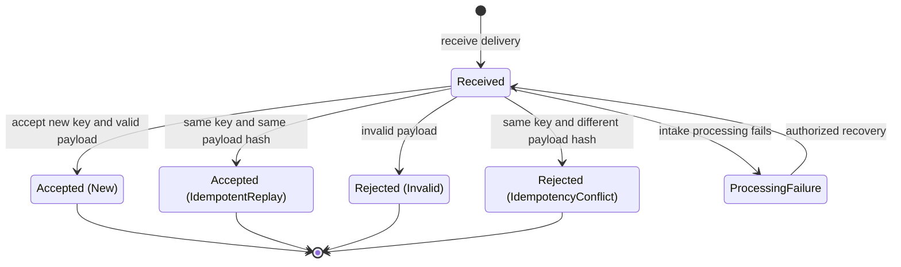
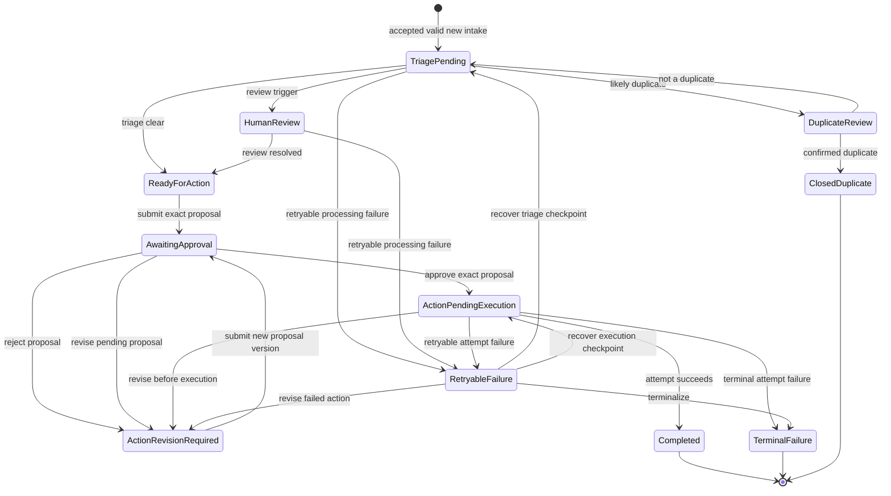
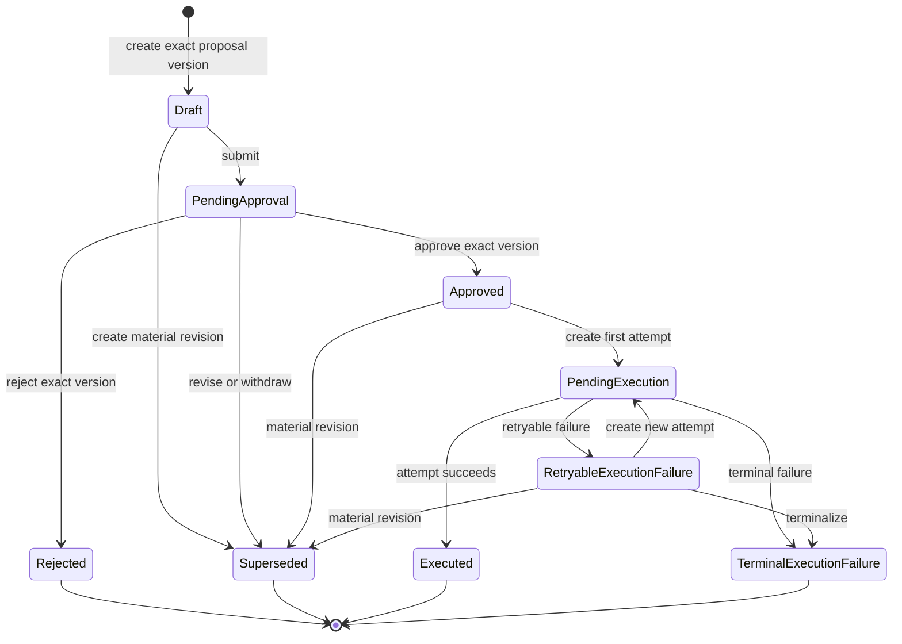
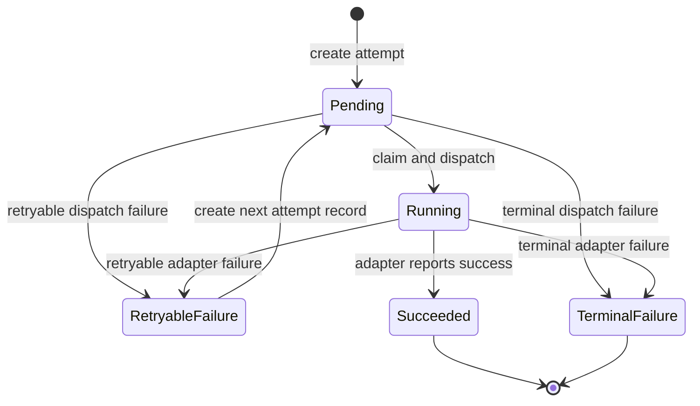

# Proposed Lifecycle State Machines

## Status and notation

This document defines implementation-neutral lifecycle behavior for the [domain model](domain-model.md); proposed database backstops and atomic patterns are defined in the [persistence design](persistence-design.md), while exact triage outputs are defined in the [deterministic triage policy](deterministic-decision-policy.md). It is an approved design, not implemented functionality. State names are shown in `PascalCase`; commands are authorized FastAPI backend operations, even when initiated by the frontend or coordinated by n8n.

Unless a row explicitly says otherwise, a failed guard leaves canonical state unchanged, returns a conflict or validation result, and records a rejected-command audit event when the attempt is security-relevant or operationally material. Successful backend-controlled transitions, required audit evidence, and integration outbox messages commit in one database transaction.

## Inbound-delivery lifecycle

### Persisted status and processing outcome

`InboundDelivery.processing_status` has four persisted values: `Received`, `Accepted`, `Rejected`, and `ProcessingFailure`. `New`, `IdempotentReplay`, `Invalid`, and `IdempotencyConflict` are persisted `idempotency_outcome` or acceptance/rejection classifications, not additional lifecycle states.

- `Accepted` + `New` links to the newly created `ServiceRequest`.
- `Accepted` + `IdempotentReplay` links to the original delivery and logical result and creates no request.
- `Rejected` + `Invalid` records contract-validation reasons and creates no request.
- `Rejected` + `IdempotencyConflict` records that the key was reused with a different canonical payload hash and creates no request.
- `ProcessingFailure` applies before atomic acceptance and creates no request. Once acceptance commits, later processing failures belong to the `ServiceRequest` or its provider attempts instead.

### Transition table

| Current state | Command or event | Required guard | Next state or outcome | Responsible actor/component | Audit event produced | Failure behavior |
| --- | --- | --- | --- | --- | --- | --- |
| No record | `ReceiveDelivery` | Source accepted; key and payload can be safely fingerprinted | `Received` | Backend intake endpoint | `inbound.delivery.received` | If persistence fails, return failure and create no untracked downstream work. |
| `Received` | `ValidateAndAccept` | Payload valid; key unused; canonical hash computed | `Accepted` + `New`; create one `ServiceRequest` in `TriagePending` | Backend intake service | `inbound.delivery.accepted`, `service_request.created` | Acceptance, request creation, and audit roll back together. |
| `Received` | `ValidateAndAccept` | Key exists and canonical hash equals original | `Accepted` + `IdempotentReplay`; return original logical result | Backend idempotency guard | `inbound.delivery.replay_recognized` | Never create another request or repeat downstream commands. |
| `Received` | `ValidateAndAccept` | Contract validation fails | `Rejected` + `Invalid` | Backend validation policy | `inbound.delivery.rejected` | Persist sanitized validation reasons; no service request is created. |
| `Received` | `ValidateAndAccept` | Key exists but canonical hash differs | `Rejected` + `IdempotencyConflict` | Backend idempotency guard | `inbound.delivery.idempotency_conflict` | Return conflict; preserve original result and create no service request. |
| `Received` | Processing exception | Failure occurs before atomic acceptance and is classified retryable | `ProcessingFailure` | Backend intake service | `inbound.delivery.processing_failed` | Record sanitized failure; do not partially create a request. Nonretryable failures remain inspectable and require operator disposition. |
| `ProcessingFailure` | `RecoverInboundDelivery` | Authorized actor; retryable classification; no accepted result exists; observed version current | `Received`, then re-evaluate through the same acceptance guards | Backend recovery command, optionally requested by operations/n8n | `inbound.delivery.recovery_started` | Conflict if already recovered/accepted; repeated recovery cannot bypass idempotency. |
| `Accepted` or `Rejected` | Any retry command | Terminal outcome already exists | No state change; original result or conflict | Backend command guard | `inbound.delivery.retry_refused` when operationally material | Never reopen or duplicate the logical intake result. |

## Service-request lifecycle

### State meanings

| State | Meaning |
| --- | --- |
| `TriagePending` | A valid request exists and interpretation, duplicate checks, or a versioned deterministic policy calculation remain incomplete. |
| `HumanReview` | A policy review gate for ambiguity, missing information, low confidence, urgency, or unavailable routing evidence requires a person before action preparation. |
| `DuplicateReview` | One or more likely duplicates require explicit human resolution. |
| `ReadyForAction` | Triage is complete and an operator may prepare the next proposed action. |
| `AwaitingApproval` | An exact proposed-action version is frozen and waiting for an authorized decision. |
| `ActionRevisionRequired` | The proposal was rejected or a revision is otherwise required; no outbound execution is allowed. |
| `ActionPendingExecution` | An exact proposal has valid approval and is eligible for initial execution or an authorized retry. |
| `RetryableFailure` | Request progress is blocked at a recorded recovery checkpoint by a retryable processing or execution failure. |
| `Completed` | The approved logical outbound operation succeeded and the request's MVP workflow is complete. |
| `TerminalFailure` | Progress cannot continue automatically or through the approved retry policy. History remains inspectable. |
| `ClosedDuplicate` | A human confirmed this request duplicates another record; it is closed without merge or outbound execution. |

Priority, queue, proposed-action state, approval validity, and attempt state remain separate. A request status summarizes its checkpoint; detailed execution truth remains on `ProposedAction` and `IntegrationAttempt`.

### Transition table

| Current state | Command or event | Required guard | Next state or outcome | Responsible actor/component | Audit event produced | Failure behavior |
| --- | --- | --- | --- | --- | --- | --- |
| No request | Accepted-new intake | Delivery is valid, nonconflicting, and not a replay | `TriagePending` | Backend intake service | `service_request.created` | Request, delivery acceptance, and audit roll back together. |
| `TriagePending` | `CompleteTriage` | Current validated interpretation and canonical evidence are present; the selected policy finds a pending material duplicate candidate | `DuplicateReview`; queue `DuplicateReview` | Backend deterministic routing policy | `routing_decision.created`, `duplicate_candidate.created` when applicable, `service_request.triage_completed`, `service_request.duplicate_review_required`, `service_request.queue_changed` | Stale required evidence rejects the command; a decision, candidates, state, queue, audit, and outbox all roll back together on failure. |
| `TriagePending` | `CompleteTriage` | No pending material duplicate; selected policy finds Urgent priority, missing information, low confidence, category ambiguity/conflict, or another review gate | `HumanReview`; queue `HumanReview` | Backend deterministic routing policy | `routing_decision.created`, `service_request.triage_completed`, `service_request.human_review_required`, `service_request.queue_changed` | AI cannot choose a final output; invalid/stale policy input fails without transition. |
| `TriagePending` | `CompleteTriage` | Required evidence present; no review gate; final priority is High, Low, or Normal | `ReadyForAction`; queue `PriorityRequests` for High or `StandardRequests` for Low/Normal | Backend deterministic routing policy | `routing_decision.created`, `service_request.triage_completed`, optional `service_request.ready_for_action` and `service_request.queue_changed` | Decision and state update roll back together on failure. |
| `TriagePending` or `HumanReview` | Processing failure | Failure classified retryable and recovery checkpoint recorded | `RetryableFailure`; queue `FailedRetryRequired` | Backend processing command or adapter result handler | `service_request.processing_failed`, `service_request.queue_changed` | A terminal classification uses `MarkTerminalFailure`; no hidden automatic loop. |
| `DuplicateReview` | `ResolveDuplicate` | Authorized reviewer; current candidate evidence; confirmed duplicate target exists | `ClosedDuplicate`; no active queue | Authorized operations user through backend | `duplicate_candidate.resolved`, `service_request.closed_duplicate` | Stale/concurrent resolution conflicts; records are never merged or deleted silently. |
| `DuplicateReview` | `ResolveDuplicate` | Authorized reviewer; all material candidates resolved as not duplicate | `TriagePending`; queue cleared pending recalculation | Authorized operations user through backend | `duplicate_candidate.resolved`, `service_request.triage_reopened` | Incomplete candidate resolution keeps `DuplicateReview`. |
| `HumanReview` | `CompleteHumanReview` | At least one allowlisted reviewed fact, rationale, and supporting evidence are valid; expected request version, current policy/interpretation/duplicate evidence are current; no pending duplicate. `OperationsAgent` only when current and recalculated priority are non-Urgent; `ManagerApprover` or `Administrator` when Urgent or correcting a hard safety/continuity fact. | Always insert a complete new routing decision and update current decision/category/priority/review summary/status/queue/version. Clear result: `ReadyForAction` with calculated queue; incomplete result: `HumanReview`/`HumanReview`, `review_required=true`, complete outstanding codes, and incremented version. | Authorized operations user through backend | `reviewed_facts.recorded`, `routing_decision.recalculated`, either `service_request.human_review_completed` or `service_request.human_review_incomplete`; `service_request.queue_changed` only if changed | Every fact, decision, request, version, audit, command, and applicable outbox write commits or rolls back together. Old-version concurrent submissions conflict; no note-only path exists. |
| `ReadyForAction` | `SubmitProposedAction` | Authorized operator; exact proposal version frozen; current request version; proposal belongs to the request/series outbound operation created with its draft; no active proposal awaiting decision | `AwaitingApproval`; queue `HumanReview` | Authorized operations user through backend | `proposed_action.submitted`, `service_request.awaiting_approval`, `service_request.queue_changed` | Invalid or concurrent proposal leaves both aggregates unchanged. |
| `AwaitingApproval` | `ApproveProposedAction` | `ManagerApprover` or `Administrator`; actor UUID not in frozen proposal attribution exclusion; exact active proposal ID/version/digest; no prior effective decision | `ActionPendingExecution`; queue `StandardRequests` for Low/Normal, `PriorityRequests` for High, or `HumanReview` for Urgent | Authorized distinct approver through backend | `approval.approved`, `service_request.action_approved`, optional `service_request.queue_changed` | Authorization, self-approval, stale version, or digest mismatch rejects without approval or execution. |
| `AwaitingApproval` | `RejectProposedAction` | Same distinct-approver, attribution, exact-version/digest, and no-prior-decision guards as approval | `ActionRevisionRequired`; queue `HumanReview` | Authorized distinct approver through backend | `approval.rejected`, `service_request.action_revision_required` | Self-decision or conflicting second decision is rejected; no outbound attempt is created. |
| `AwaitingApproval` | `CreateMaterialRevision` | Authorized operator; active proposal `PendingApproval`; no approval decision, active attempt, or successful logical operation; request/proposal versions current; replacement uses the same request, proposal series, and outbound operation | Old proposal `Superseded`; replacement `Draft` becomes active under the existing operation; request `ActionRevisionRequired`; queue remains `HumanReview` | Authorized operations user through backend | `proposed_action.superseded`, `proposed_action.version_created`, `service_request.action_revision_required` | Any guard failure leaves request, active reference, and proposal unchanged; no approval or new operation is created. |
| `ActionPendingExecution` | `CreateMaterialRevision` | Authorized operator; active proposal `Approved`; no `Pending`/`Running` or successful attempt/operation; request/proposal versions current; replacement uses the same request, series, and operation | Old proposal `Superseded`; replacement `Draft` becomes active under the existing operation; request `ActionRevisionRequired`; queue changes to `HumanReview` | Authorized operations user through backend | `proposed_action.superseded`, `proposed_action.version_created`, `approval.execution_validity_lost`, `service_request.action_revision_required`, `service_request.queue_changed` | Any guard failure leaves the approved action executable only under its existing state; revision creates no attempt or operation. |
| `RetryableFailure` | `CreateMaterialRevision` | Authorized operator; recovery target `ActionPendingExecution`; active proposal `RetryableExecutionFailure`; no active/successful attempt or operation success; request/proposal versions current; replacement uses the same request, series, and operation | Old proposal `Superseded`; replacement `Draft` becomes active under the existing operation; request `ActionRevisionRequired`; queue `HumanReview`; execution recovery target cleared | Authorized operations user through backend | `proposed_action.superseded`, `proposed_action.version_created`, `approval.execution_validity_lost`, `service_request.action_revision_required`, `service_request.queue_changed` | Any guard failure keeps the prior failure and recovery target; previous approval and exact attempt binding remain immutable. |
| `ActionRevisionRequired` | `SubmitRevisedAction` | Authorized operator; active replacement proposal is `Draft`; request/proposal versions current; replacement belongs to same request, proposal series, and existing outbound operation; required payload present | Replacement payload/version/digest frozen; proposal `PendingApproval`; request `AwaitingApproval`; queue remains `HumanReview`; new approval required | Authorized operations user through backend | `proposed_action.submitted`, `service_request.awaiting_approval` | Reusing the old proposal/approval, submitting a stale draft, or crossing request/series/operation boundaries is rejected atomically. |
| `ActionPendingExecution` | `RecordAttemptSucceeded` | Exact approved proposal; matching running attempt; adapter result is idempotent and successful | `Completed`; active queue cleared | Backend adapter result handler | `integration_attempt.succeeded`, `proposed_action.executed`, `service_request.completed` | Contradictory/duplicate provider results conflict; completed operation cannot execute again. |
| `ActionPendingExecution` | `RecordRetryableAttemptFailure` | Matching active attempt; failure classified retryable; no successful attempt exists | `RetryableFailure`; recovery target `ActionPendingExecution`; queue `FailedRetryRequired` | Backend adapter result handler | `integration_attempt.retryable_failure`, `service_request.processing_failed`, `service_request.queue_changed` | No in-place attempt retry; failure remains historical. |
| `ActionPendingExecution` | `RecordTerminalAttemptFailure` | Matching active attempt; failure nonretryable or policy exhausted | `TerminalFailure`; active queue cleared; derived failed-work visibility retained | Backend adapter result handler | `integration_attempt.terminal_failure`, `service_request.terminal_failure`, `service_request.queue_changed` | No retry command is allowed. Manual investigation remains possible without rewriting state. |
| `RetryableFailure` | `RecoverProcessing` | Authorized; current version; retry still eligible; recovery target `TriagePending` | `TriagePending`; queue cleared pending recalculation | Backend recovery command, optionally requested by operations/n8n | `service_request.recovery_started` | Failure or stale version leaves the request in `RetryableFailure`. |
| `RetryableFailure` | `RetryOutbound` | Authorized; recovery target `ActionPendingExecution`; exact approval still valid; no active/successful attempt; retry policy allows | `ActionPendingExecution`; create a new `Pending` attempt | Backend recovery command, optionally requested by operations/n8n | `service_request.recovery_started`, `integration_attempt.created` | Atomic guard failure creates no attempt and keeps `RetryableFailure`. |
| `RetryableFailure` | `MarkTerminalFailure` | Authorized disposition or retry policy exhausted; reason recorded | `TerminalFailure`; active queue cleared; derived failed-work visibility retained | `ManagerApprover` or `Administrator` through backend | `service_request.terminal_failure`, `service_request.queue_changed` | Missing authority/reason leaves state unchanged. |
| `Completed`, `TerminalFailure`, or `ClosedDuplicate` | Any normal transition command | State is terminal | No state change; return conflict/current result | Backend command guard | `service_request.transition_refused` when material | Never reopen through ordinary retry; a future reopen capability requires a separate approved design. |

All material revision rows are one backend transaction: check both optimistic versions, the shared request/series/operation identity, and all attempt/approval guards; supersede the old proposal; create and activate the replacement draft with the same logical operation; transition the request; update its queue; clear obsolete recovery data when present; and append audit events. A revision never creates a second outbound operation. `service_request.action_revision_required` identifies both proposal versions, the retained operation ID, and whether a recovery target was cleared.

## Proposed-action lifecycle

Execution outcomes are recorded on `IntegrationAttempt`. `ProposedAction.state` is the backend-maintained summary for the exact proposal version and is updated transactionally with the attempt result. The attempt record is the detailed evidence; the action state makes authorization and operational reads unambiguous.

### Transition table

| Current state | Command or event | Required guard | Next state or outcome | Responsible actor/component | Audit event produced | Failure behavior |
| --- | --- | --- | --- | --- | --- | --- |
| No proposal | `CreateDraftAction` | Authorized operator; service request `ReadyForAction` or `ActionRevisionRequired`; no conflicting active draft | Atomically create proposal series, its outbound logical operation, and version `1` in `Draft` | Authorized operations user through backend | `proposed_action.created` | Invalid request checkpoint, operation/series uniqueness, or concurrency creates none of the graph. |
| `Draft` | `SubmitForApproval` | Required action fields present; immutable payload digest created; current service request | `PendingApproval` | Authorized operations user through backend | `proposed_action.submitted` | Validation failure leaves `Draft`; approval cannot target an unfrozen payload. |
| `Draft` | `CreateMaterialRevision` | Authorized operator; request/proposal versions current; replacement belongs to same request, series, and existing operation; no decision, active attempt, or operation success | Old version `Superseded`; replacement `Draft` becomes active under the same operation; parent request remains `ReadyForAction` or `ActionRevisionRequired` | Authorized operations user through backend | `proposed_action.superseded`, `proposed_action.version_created` | Active-reference update and both proposal writes commit together; no approval or operation is created. |
| `PendingApproval` | `CreateMaterialRevision` | Parent request `AwaitingApproval`; authorized operator; current versions; same request/series/operation; no decision, active attempt, or operation success | Old version `Superseded`; replacement `Draft` under the same operation; parent request `ActionRevisionRequired` in `HumanReview` | Authorized operations user through backend | `proposed_action.superseded`, `proposed_action.version_created`, `service_request.action_revision_required` | Parent and proposal changes are atomic; guard failure leaves both unchanged and creates no operation. |
| `PendingApproval` | `ApproveProposedAction` | `ManagerApprover` or `Administrator`; actor UUID not in frozen attribution exclusion; exact ID/version/digest; no existing effective decision | `Approved` | Authorized distinct approver through backend | `approval.approved`, `proposed_action.approved` | Self-approval, stale digest, unauthorized role, or prior decision leaves state unchanged. |
| `PendingApproval` | `RejectProposedAction` | Same distinct-approver, attribution, exact-version/digest, and no-prior-decision guards as approval | `Rejected` | Authorized distinct approver through backend | `approval.rejected`, `proposed_action.rejected` | Self-decision is forbidden and no integration attempt can be created. |
| `Approved` | `StartOutboundOperation` | Approval remains valid; exact active proposal references the existing request/series operation; no attempt active or operation succeeded; reserve/reuse its stable outbound key | `PendingExecution`; create next `Pending` attempt with immutable exact proposal/version/digest, approval, adapter intent, and key binding | Backend execution command, optionally requested by n8n | `proposed_action.execution_started`, `integration_attempt.created` | Guard failure creates no attempt or operation. |
| `Approved` | `CreateMaterialRevision` | Parent request `ActionPendingExecution`; authorized operator; current versions; same request/series/operation; no `Pending`/`Running` attempt or operation success | Old version `Superseded`; replacement `Draft` under the same operation; parent request `ActionRevisionRequired` in `HumanReview`; prior approval unusable for execution | Authorized operations user through backend | `proposed_action.superseded`, `approval.execution_validity_lost`, `proposed_action.version_created`, `service_request.action_revision_required`, `service_request.queue_changed` | Parent/proposal changes are atomic; no outbound attempt or operation is created. |
| `PendingExecution` | Successful attempt result | Matching attempt and idempotency key; provider success not contradicted | `Executed` | Backend adapter result handler | `proposed_action.executed` | Duplicate same result is idempotent; contradictory result conflicts and is investigated. |
| `PendingExecution` | Retryable attempt failure | Matching attempt; retryable classification; no success | `RetryableExecutionFailure` | Backend adapter result handler | `proposed_action.retryable_execution_failure` | Attempt remains failed; no automatic in-place retry. |
| `PendingExecution` | Terminal attempt failure | Matching attempt; nonretryable classification or policy exhausted | `TerminalExecutionFailure` | Backend adapter result handler | `proposed_action.terminal_execution_failure` | Further attempts are forbidden. |
| `PendingExecution` | `CreateMaterialRevision` | An attempt is `Pending`/`Running` or its outcome is unresolved | No state change; conflict | Backend command guard | `proposed_action.revision_refused` | Revision waits for a recorded attempt outcome; it never races active or uncertain outbound work. |
| `RetryableExecutionFailure` | `RetryOutbound` | Exact proposal/approval still valid; no active attempt or operation success; retry policy permits; same logical operation/key | `PendingExecution`; create next `Pending` attempt with a fresh immutable exact execution binding | Backend recovery command | `proposed_action.execution_retried`, `integration_attempt.created` | Failure creates no attempt and preserves retryable state/history. |
| `RetryableExecutionFailure` | `CreateMaterialRevision` | Parent request `RetryableFailure` targeting `ActionPendingExecution`; authorized operator; current versions; same request/series/operation; no active attempt or operation success | Old version `Superseded`; replacement `Draft` under the same operation; parent request `ActionRevisionRequired` in `HumanReview`; recovery target cleared; new approval required | Authorized operations user through backend | `proposed_action.superseded`, `approval.execution_validity_lost`, `proposed_action.version_created`, `service_request.action_revision_required`, `service_request.queue_changed` | Previous attempt bindings and approval remain immutable; atomic failure preserves the retry path. |
| `RetryableExecutionFailure` | `MarkTerminalExecutionFailure` | Retry policy exhausted or authorized disposition with reason | `TerminalExecutionFailure` | `ManagerApprover` or `Administrator` through backend | `proposed_action.terminal_execution_failure` | Missing guard leaves state unchanged. |
| `Rejected` | `CreateRevisionAfterRejection` | Parent request `ActionRevisionRequired`; authorized operator; current versions; replacement belongs to the same request, proposal series, and existing outbound operation; operation has no success | Existing proposal remains `Rejected`; replacement `Draft` becomes active under the same operation; parent request remains `ActionRevisionRequired` | Authorized operations user through backend | `proposed_action.version_created` | Historical rejection is never rewritten, its decision never transfers, and no operation is created. |
| Any proposal version in a successful operation | `CreateMaterialRevision`, start, or retry | Shared logical operation already has a successful attempt | No state change; conflict/current result | Backend command guard | `proposed_action.revision_refused` or `integration_attempt.retry_refused` | Success under any version blocks the whole series from another attempt or revision. |
| `TerminalExecutionFailure` | `CreateMaterialRevision` or retry | Parent request is `TerminalFailure`; ordinary commands cannot reopen terminal work | No state change; conflict | Backend command guard | `proposed_action.revision_refused` or `integration_attempt.retry_refused` | A future exceptional reopen requires a separately approved administrative design; it is not an MVP revision path. |
| `Executed`, `Rejected`, `Superseded`, or `TerminalExecutionFailure` | `StartOutboundOperation` or retry | State not executable | No state change; conflict | Backend command guard | `proposed_action.execution_refused` | No attempt is created. A successful logical operation can never be retried. |

## Integration-attempt lifecycle

Each record is one AI or outbound adapter invocation. The diagram's retry arrow creates a new attempt record; it does not move the failed record back to `Pending`.

### Transition table

| Current state | Command or event | Required guard | Next state or outcome | Responsible actor/component | Audit event produced | Failure behavior |
| --- | --- | --- | --- | --- | --- | --- |
| No attempt | `CreateIntegrationAttempt` | Existing operation owner/input current; no active attempt or operation success; next attempt number unique; outbound work additionally has exact valid proposal/digest/approval and its operation's stable key | New attempt `Pending` with immutable exact execution binding when outbound | Backend execution/recovery command | `integration_attempt.created` | Transaction conflict creates no attempt, operation, or owner-state transition. |
| `Pending` | `StartIntegrationAttempt` | Worker owns valid claim; referenced request/input remains current; outbound proposal/approval remains valid; no successful sibling attempt | `Running` | Backend adapter worker; n8n may trigger the backend command | `integration_attempt.started` | Claim conflict leaves `Pending`; pre-dispatch policy failure is classified explicitly. |
| `Pending` or `Running` | `ReplaceCallbackCredential` | Assigned WorkflowService HMAC identity/environment; callback-authorization deadline unexpired; expected active credential version exact | Attempt state unchanged; old credential replaced; one next version active | Authorized WorkflowService through backend | `integration_attempt.callback_credential_replaced` security audit only | Stale version conflicts; wrong scope, terminal/expired attempt, or command replay creates no extra active credential or domain event. |
| `Pending` | Dispatch failure | Matching claim; provider not invoked or outcome known failed | `RetryableFailure` or `TerminalFailure` by policy | Backend adapter worker | `integration_attempt.retryable_failure` or `integration_attempt.terminal_failure` | Never assume success; record whether provider invocation was possible/uncertain. |
| `Running` | `RecordIntegrationSuccess` | Matching attempt/correlation; adapter reports success; no successful sibling | `Succeeded` | Backend adapter result handler | `integration_attempt.succeeded` | Same repeated result is idempotent; contradictory result is a conflict requiring investigation. |
| `Running` | `RecordIntegrationFailure` | Matching attempt/correlation; error classified retryable | `RetryableFailure` | Backend adapter result handler | `integration_attempt.retryable_failure` | Preserve the attempt; retry requires a new record under the same logical operation, retaining the outbound key when applicable. |
| `Running` | `RecordIntegrationFailure` | Matching attempt/correlation; error nonretryable or retry policy exhausted | `TerminalFailure` | Backend adapter result handler | `integration_attempt.terminal_failure` | No retry attempt may be created. |
| `RetryableFailure` | `RetryIntegration` | No active/successful sibling; retry window/policy permits; original operation input remains valid; outbound work additionally has exact valid approval and stable key | Failed record remains unchanged; create next attempt `Pending` | Backend recovery command | `integration_attempt.retry_requested`, `integration_attempt.created` | Guard failure creates no attempt. |
| `Succeeded` or `TerminalFailure` | Any start/retry command | Attempt is terminal | No state change | Backend command guard | `integration_attempt.retry_refused` when material | A succeeded attempt and its logical operation cannot execute again. |

### Logical-operation and idempotency rules

- Every attempt for one AI interpretation run or intended outbound side effect shares one `logical_operation_id`.
- One outbound logical operation is created with the first proposal draft and is shared by every version in that proposal series. Material revision never creates another outbound operation; AI operations remain input/configuration identities created when AI interpretation starts.
- Attempt numbers increase monotonically and are unique within the logical operation.
- At most one attempt can be `Pending` or `Running` for a logical operation, and at most one attempt can be `Succeeded`.
- Every outbound attempt immutably binds the exact proposal ID/version/digest, approval-decision ID, adapter/version intent, and stable outbound key it executes; later revision never rewrites this history.
- AI retries retain the same input hash and prompt/schema/provider version intent; a changed input or configuration starts a new interpretation logical operation and version.
- Every outbound attempt additionally shares one stable outbound idempotency key.
- An outbound timeout with unknown outcome is retryable only if the adapter can safely reuse the stable outbound idempotency key or otherwise reconcile the outcome. Without that protection, it requires human review rather than blind retry. AI retry safety is governed separately because it does not perform the customer-facing side effect.
- The mock email adapter follows the same contract and records simulated results; it sends no real email.

## Operational queue design

Operational queues are backend-controlled work views, not lifecycle states. For `ServiceRequest`, `current_queue` is persisted for stable querying and concurrency but is calculated only by backend routing/transition policy. Routing inputs and outputs are retained in versioned `RoutingDecision` records. Terminal requests have no active queue, although their prior queue changes remain auditable.

For `InboundDelivery`, queue membership is derived from persisted processing status and outcome; a separate mutable queue field is unnecessary. The frontend and n8n consume backend-provided queue values and never reproduce authoritative queue logic.

| Operational view (display label) | Record type | Authoritative inclusion | Membership design |
| --- | --- | --- | --- |
| Invalid submissions | `InboundDelivery` only | `Rejected` with `Invalid` or `IdempotencyConflict` outcome | Derived from persisted delivery facts; no `ServiceRequest` exists. |
| Standard requests | `ServiceRequest` only | Active request without higher-precedence review/failure condition and final priority `Low` or `Normal` | Persisted `current_queue`, assigned by backend rules. |
| Priority requests | `ServiceRequest` only | Active request without higher-precedence review/failure condition and final priority `High` | Persisted `current_queue`, assigned by backend rules. Urgent requests remain in `HumanReview`. |
| Human review | `ServiceRequest` only | `HumanReview`, `AwaitingApproval`, or `ActionRevisionRequired`, or another approved review guard | Persisted `current_queue`, assigned by backend transition policy. |
| Duplicate review | `ServiceRequest` only | `DuplicateReview` with unresolved candidate evidence | Persisted `current_queue`, assigned by backend transition policy. |
| Failed/retry required | `InboundDelivery` and `ServiceRequest` | Delivery `ProcessingFailure`; request `RetryableFailure` or terminal failure requiring historical visibility | Derived for deliveries and terminal requests; persisted as `current_queue` only for active `RetryableFailure` requests. Retry eligibility is read from failure facts, not inferred from view membership. |

Queue precedence is `FailedRetryRequired`, `DuplicateReview`, `HumanReview`, then `StandardRequests` or `PriorityRequests`. After approval, `ActionPendingExecution` uses `StandardRequests` for Low/Normal, `PriorityRequests` for High, and `HumanReview` for Urgent oversight. Initial `TriagePending` processing may have no active queue; terminal `Completed`, `TerminalFailure`, and `ClosedDuplicate` records have no active queue. Policy-caused `service_request.queue_changed` audit records include old/new wire values, stable reason codes, and policy ID/version/digest. Lifecycle-only queue changes retain their lifecycle reason and do not fabricate a routing decision or policy cause. Priority changes produce separate decision evidence; moving queues never silently changes priority.

## Required invariants

1. AI output cannot directly set final category, priority, queue, approval, or lifecycle state.
2. An invalid or idempotency-conflicting delivery cannot create a normal service request.
3. A likely duplicate remains a separate record until an authorized human resolves it; it is never silently merged.
4. No outbound attempt can begin without a valid approval for the exact active proposal ID, version, and payload digest.
5. A rejected or superseded proposal cannot execute.
6. A logical outbound operation with a successful attempt cannot execute again.
7. Any provider retry creates a new attempt record under the same logical operation and never rewrites a failed attempt. An outbound retry also retains the same stable outbound key and exact logical action.
8. Replayed intake cannot create another request or repeat downstream side effects.
9. A reused intake key with a different canonical payload hash is a conflict.
10. Backend-controlled state transitions append audit evidence in the same transaction.
11. State and audit history are not rewritten to hide errors, decisions, superseded proposals, or failed attempts.
12. Only authorized backend commands change canonical state; frontend, n8n, AI, and adapters provide intent or evidence only.
13. Mutable aggregate updates use optimistic version checks or an equivalent atomic compare-and-change guard, so concurrent commands cannot silently overwrite newer state.
14. A permitted material revision atomically supersedes the old proposal, activates a replacement `Draft`, moves the request to `ActionRevisionRequired` in `HumanReview`, clears obsolete execution recovery data, and makes any old approval unusable for the replacement.
15. Operational and audit records are not hard-deleted in the MVP.
16. UUID identity, UTC timestamps, and historical policy/schema/prompt/adapter version references are retained across all persisted records.
17. Only a `ManagerApprover` or `Administrator` whose actor UUID is absent from the exact proposal's frozen creator/material-editor attribution may approve or reject; no service identity can create a human approval decision.
18. Every proposal version in one series references the same request-owned outbound logical operation; a successful attempt under any version forbids later attempts and material revisions for the entire operation.

## Approved demo-scenario mapping

| # | Scenario | Starting entity/state | Commands or events and important guards | Expected final state | Expected operational queue | Audit evidence | Outbound attempt? |
| --- | --- | --- | --- | --- | --- | --- | --- |
| 1 | Valid standard request | New `InboundDelivery` | Receive; valid unused key; accept; interpret; no duplicate/review trigger; deterministic Low/Normal routing | Delivery `Accepted`; request `ReadyForAction` | `StandardRequests` | Delivery received/accepted, request created, interpretation created, routing decision, triage completed, queue change | No |
| 2 | High-priority request | New `InboundDelivery` | Same intake path; deterministic policy produces High; no higher-precedence review trigger | Request `ReadyForAction`, priority High | `PriorityRequests` | Routing decision includes policy ID/version/digest and reasons; queue change | No |
| 3 | Urgent request requiring approval | Request `TriagePending` | Interpretation evidence accepted; backend rules produce Urgent; urgent guard forces review | Request `HumanReview`, priority Urgent | `HumanReview` | Interpretation, routing decision, review reason, queue change | No |
| 4 | Invalid submission | Delivery `Received` | Contract validation fails | Delivery `Rejected` + `Invalid`; no request | `InvalidSubmissions` | Delivery received and rejected with sanitized validation reasons | No |
| 5 | Missing-information case | Request `TriagePending` | Current evidence lists important missing information; backend review policy applies | Request `HumanReview` | `HumanReview` | Interpretation version, routing/review decision, queue change | No |
| 6 | Low-confidence AI result | Request `TriagePending` | Confidence below configured threshold; threshold/policy version recorded | Request `HumanReview` | `HumanReview` | Interpretation, deterministic threshold decision, queue change | No |
| 7 | Possible duplicate | Request `TriagePending` | Candidate evidence created; unresolved candidate guard | Request `DuplicateReview`; candidate pending | `DuplicateReview` | Candidate detected, routing decision, state/queue change | No |
| 8 | Repeated webhook delivery | New physical delivery with key used by an accepted delivery | Canonical payload hash matches; replay guard returns original logical result | Replay delivery `Accepted` + `IdempotentReplay`; original request unchanged | Original request's current queue; replay itself has no active queue | Delivery received and replay recognized, linked original result | No new attempt |
| 9 | AI-provider failure | Request `TriagePending`; AI attempt `Running` | Adapter call fails; classified retryable; recovery checkpoint recorded | Request `RetryableFailure`; AI attempt `RetryableFailure` | `FailedRetryRequired` | Integration-attempt failure, request processing failure, queue change, prompt/schema/adapter version and correlation | No outbound attempt; one failed AI attempt |
| 10 | Mock email failure followed by retry | Request `ActionPendingExecution`; approved action; first attempt `Running` | Mock failure classified retryable; exact approval remains valid; no success/active attempt; retry creates attempt 2 with same outbound key; attempt 2 succeeds | Request `Completed`; action `Executed`; attempt 1 `RetryableFailure`, attempt 2 `Succeeded` | No active queue | Both attempt histories, failure/recovery, retry creation, mock success, action/request completion | Yes—two attempt records for one logical operation |
| 11 | Approved outbound action | Request `AwaitingApproval`; proposal `PendingApproval` | Authorized approver; exact ID/version/digest; start operation; mock success | Request `Completed`; proposal `Executed`; attempt `Succeeded` | No active queue | Approval identity/decision, execution start, attempt success, completion | Yes—one mock attempt |
| 12 | Rejected outbound action | Request `AwaitingApproval`; proposal `PendingApproval` | Authorized approver rejects exact ID/version/digest; if revised, authorized operator creates a same-request/series `Draft` and `SubmitRevisedAction` freezes and resubmits it | Immediate: request `ActionRevisionRequired`, old proposal `Rejected`; after revision/resubmission: request `AwaitingApproval`, replacement `PendingApproval` requiring a new decision | `HumanReview` | Rejection decision; optional replacement version creation and submission; no approval transfer or adapter event | No |

All 12 approved scenarios are representable without conflating delivery, request, proposal, approval, or attempt state.
